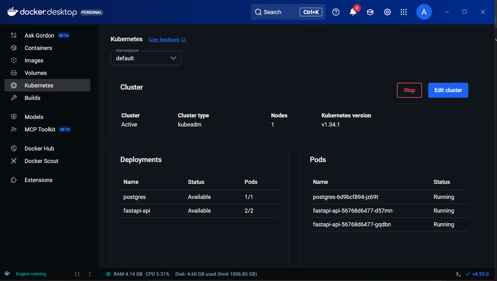
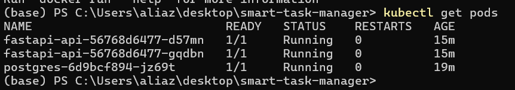
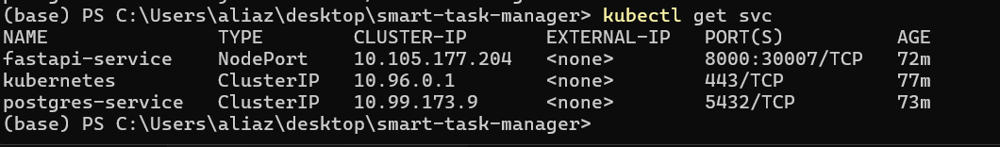
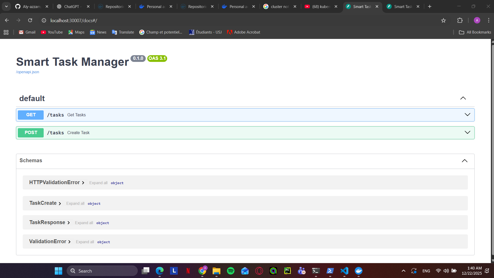
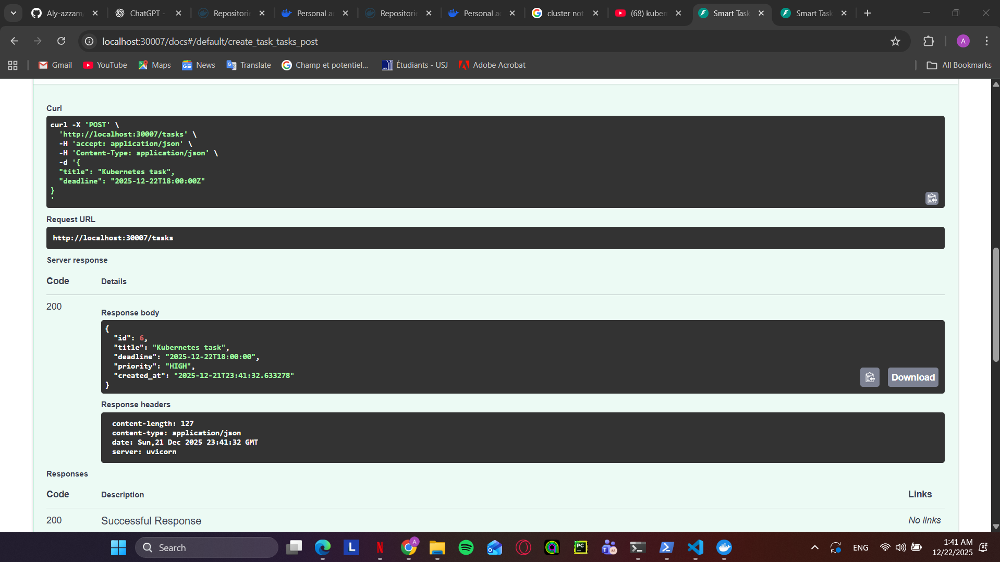
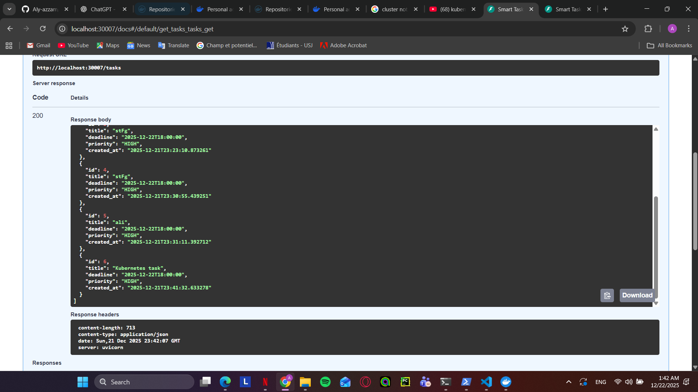

# Smart Task Manager with Priority Prediction

This project is a DevOps-oriented application designed to demonstrate containerization,
CI/CD automation, and Kubernetes deployment practices.

The application exposes a REST API for managing tasks and assigns priorities based on
task attributes. The main focus of the project is the DevOps pipeline and infrastructure
rather than application complexity.

## Architecture Overview

The system architecture follows a containerized microservice approach:

- FastAPI application container
- PostgreSQL database container (external to Kubernetes)
- Docker for containerization
- GitHub Actions for CI/CD
- Kubernetes manifests for orchestration

The architecture prioritizes simplicity, portability, and DevOps best practices.

## Application Features

- Create, list, and manage tasks via REST API
- Automatic priority assignment (LOW / MEDIUM / HIGH)
- Swagger UI available for API testing
- Health endpoint for service validation

## Docker & Docker Compose

The application is containerized using Docker.
Docker Compose is used locally to orchestrate the FastAPI service and PostgreSQL database.

This setup simplifies local development and testing while keeping the database external
to Kubernetes deployments.

## Application Validation (FastAPI)

The containerized FastAPI application was validated locally using Docker Compose.
The API is accessible through Swagger UI, which confirms that the application
starts correctly and exposes the expected endpoints.

## CI/CD Pipeline

An automated CI/CD pipeline is implemented using GitHub Actions.

Pipeline stages:
- Test stage: executes automated tests on each push and pull request
- Build stage: builds the Docker image
- Registry push stage: pushes the image to Docker Hub
This project uses GitHub Actions to implement a CI/CD pipeline with the following stages:

- Test stage (pytest smoke tests)
- Build stage (Docker image build)
- Push stage (Docker image pushed to Docker Hub)

Docker Hub authentication is handled securely using GitHub repository secrets.

### Successful CI Pipeline Run

### Advanced CI/CD Feature (Bonus)
As an advanced CI/CD feature, Docker images are tagged using both:
- `latest`
- the Git commit SHA

This tagging strategy ensures full traceability between source code versions and container images.
The build-and-push stage is executed only on the `main` branch to enforce controlled releases.

## Kubernetes Deployment

The Smart Task Manager application was successfully deployed and executed on a
local Kubernetes cluster using **Docker Desktop Kubernetes**.

The application was containerized using Docker and the image was published to
Docker Hub. Kubernetes pulls this image during deployment.

**Docker image hosted on Docker Hub:**

---

### Kubernetes Cluster Status

The following screenshot shows the Kubernetes cluster running inside Docker
Desktop. It confirms that the cluster is active and that the FastAPI and
PostgreSQL deployments are available and running.

**Docker Desktop – Kubernetes cluster overview:**

---

### Kubernetes Resources Definition

The deployment relies on the following Kubernetes resources:
- Deployments for FastAPI and PostgreSQL
- Services (NodePort and ClusterIP)
- ConfigMaps for configuration
- Secrets for sensitive credentials

---

### Pods Running Verification

The following screenshot verifies that all Kubernetes pods are running
successfully. It corresponds to the output of the `kubectl get pods` command.

**Running pods (`kubectl get pods`):**

---

### Services and Networking Configuration

The following screenshot shows the Kubernetes services configuration. It proves
that:
- The FastAPI application is exposed externally using a NodePort service
- PostgreSQL is exposed internally using a ClusterIP service

This corresponds to the output of `kubectl get svc`.

**Services configuration (`kubectl get svc`):**

---

### Accessing the Application via Kubernetes

The FastAPI application is accessible through Kubernetes at the following URL: http://localhost:30007/docs

The following screenshot confirms that the Swagger UI is reachable through the
Kubernetes NodePort service.

**Swagger UI accessed via Kubernetes:**

---

### API Execution – POST Request

The following screenshot shows a successful execution of the
`POST /tasks` endpoint via Kubernetes. This confirms that the API is functioning
correctly and that data is written to the PostgreSQL database.

**Successful POST request (`POST /tasks`):**

---

### API Execution – GET Request

The following screenshot shows a successful execution of the
`GET /tasks` endpoint via Kubernetes. This confirms that data is persisted and
retrieved correctly from the database.

**Successful GET request (`GET /tasks`):**

---

### Summary

This Kubernetes deployment demonstrates:
- A Docker image built and published to Docker Hub
- A running Kubernetes cluster
- Correct use of Deployments, Services, ConfigMaps, and Secrets
- External access to the application via NodePort
- Successful API execution (POST and GET)
- Database deployed and used inside Kubernetes

The Smart Task Manager application is therefore fully operational within a
Kubernetes environment.

## Database Architecture

The project uses a PostgreSQL database deployed **inside the Kubernetes cluster**
as a dedicated workload.

This corresponds to **Kubernetes Option A (database inside the cluster)**.

The database is managed through Kubernetes resources and accessed internally by
the FastAPI application via a ClusterIP service. This approach was chosen to:

- Ensure full portability of the application stack
- Keep all components managed by Kubernetes
- Simplify deployment and networking using Kubernetes service discovery
- Avoid external dependencies during deployment and evaluation

## Conclusion

This project demonstrates core DevOps practices including containerization,
Docker-based development, Kubernetes deployment, and environment consistency
between local and cluster execution.

The application was successfully deployed using declarative Kubernetes
manifests, with both the API and database running inside the cluster and exposed
via appropriate services. Functionality was validated through successful API
requests using Kubernetes networking.

The focus of the project was placed on correctness, clarity, and architectural
soundness rather than unnecessary complexity.

Docker Hub authentication was configured to support container image publishing
and reuse across environments.

