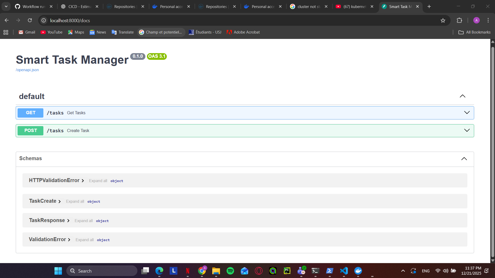
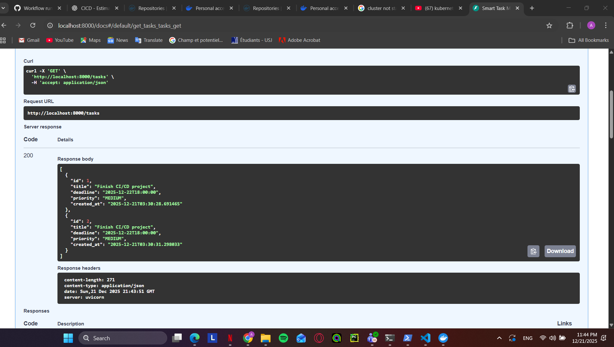
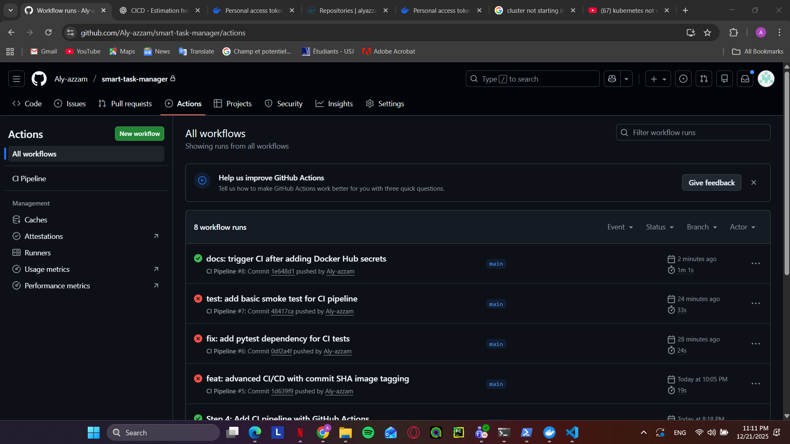

# Smart Task Manager with Priority Prediction

This project is a DevOps-oriented application designed to demonstrate containerization,
CI/CD automation, and Kubernetes deployment practices.

The application exposes a REST API for managing tasks and assigns priorities based on
task attributes. The main focus of the project is the DevOps pipeline and infrastructure
rather than application complexity.

## Architecture Overview

The system architecture follows a containerized microservice approach:

- FastAPI application container
- PostgreSQL database container (external to Kubernetes)
- Docker for containerization
- GitHub Actions for CI/CD
- Kubernetes manifests for orchestration

The architecture prioritizes simplicity, portability, and DevOps best practices.

## Application Features

- Create, list, and manage tasks via REST API
- Automatic priority assignment (LOW / MEDIUM / HIGH)
- Swagger UI available for API testing
- Health endpoint for service validation

## Docker & Docker Compose

The application is containerized using Docker.
Docker Compose is used locally to orchestrate the FastAPI service and PostgreSQL database.

This setup simplifies local development and testing while keeping the database external
to Kubernetes deployments.

## Application Validation (FastAPI)

The containerized FastAPI application was validated locally using Docker Compose.
The API is accessible through Swagger UI, which confirms that the application
starts correctly and exposes the expected endpoints.

## CI/CD Pipeline

An automated CI/CD pipeline is implemented using GitHub Actions.

Pipeline stages:
- Test stage: executes automated tests on each push and pull request
- Build stage: builds the Docker image
- Registry push stage: pushes the image to Docker Hub
This project uses GitHub Actions to implement a CI/CD pipeline with the following stages:

- Test stage (pytest smoke tests)
- Build stage (Docker image build)
- Push stage (Docker image pushed to Docker Hub)

Docker Hub authentication is handled securely using GitHub repository secrets.

### Successful CI Pipeline Run

### Advanced CI/CD Feature (Bonus)
As an advanced CI/CD feature, Docker images are tagged using both:
- `latest`
- the Git commit SHA

This tagging strategy ensures full traceability between source code versions and container images.
The build-and-push stage is executed only on the `main` branch to enforce controlled releases.

## Kubernetes Deployment

Kubernetes manifests were created to define the application deployment in a declarative manner.

Included resources:
- Deployment
- Service
- ConfigMap
- Secret

These manifests describe how the application should be deployed, configured, and exposed
within a Kubernetes cluster.

### Execution Note
Due to Docker Desktop Kubernetes instability on Windows, the local Kubernetes cluster
could not be started on the development machine. This issue is related to tooling limitations
and not to the application or manifests themselves.

The Kubernetes configuration remains valid and portable and can be applied to any standard
Kubernetes environment (Docker Desktop, Minikube, Kind, or cloud-managed Kubernetes).

## Database Architecture

The project uses an external PostgreSQL database deployed via Docker Compose.

This corresponds to Kubernetes Option B (external database).
This choice was made to:
- Simplify state management
- Avoid coupling database lifecycle with application pods
- Improve portability across environments

## Limitations

- Local Kubernetes execution was not possible due to Docker Desktop tooling issues on Windows.

## Conclusion

This project demonstrates core DevOps practices including containerization, CI/CD automation,
and Kubernetes configuration. The focus was placed on correctness, clarity, and reasoning
rather than tool overuse or unnecessary complexity.

Docker Hub authentication configured for CI pipeline.

## Docker Image Registry (Docker Hub)

The CI/CD pipeline automatically builds and pushes the application Docker image to Docker Hub.

